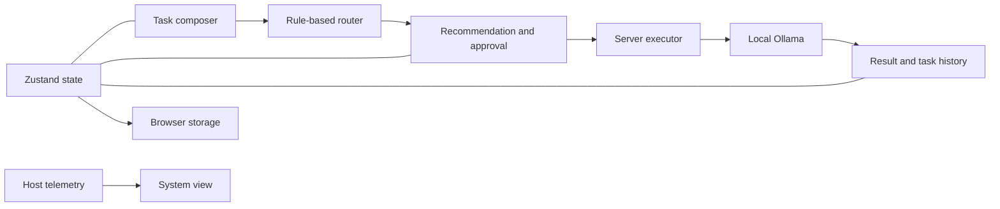

# router_agent / JEV project report

**Report date:** October 1, 2026  
**Assessment:** Working local agent-routing application; cloud integrations and production hardening remain incomplete.  
**Source baseline:** `eae148b1e02d428f9f1d6dd2f7f7a774a79d28ae`, with local improvements not yet committed.

This report reviews the current source and the saved validation results from the latest improvement session. Tests were not rerun solely to produce this report.

## 1. Purpose and current scope

The repository is named **router_agent**. Its interface is branded **JEV**. It helps a user describe a task, choose an execution approach, review a recommended provider, approve execution, and inspect the result.

The routing engine uses keyword-based task classification and weighted provider scores. It considers task fit, complexity, execution mode, a privacy preference, provider availability, and active jobs. It is deterministic; it does not use a trained routing model. The displayed confidence is a score-derived heuristic, not a measured probability of success.

The complete execution path has been demonstrated with an existing local Ollama model. The project does not yet provide a fully connected multi-provider agent system.

## 2. Capabilities

| Area | Current capability | Status |
|---|---|---|
| Task composition | Description, examples, Fast/Balanced/Deep modes, project selection, provider override | Implemented |
| Route review | Provider/model recommendation, reasoning, confidence, execution location, alternatives | Implemented |
| Approval | Explicit approval before execution; unavailable providers disabled in the review UI | Implemented |
| Local execution | Ollama discovery, generation, cancellation, result display | Verified live |
| Task history | Search, filters, state badges, elapsed time, rerouting, event logs | Implemented and browser-checked |
| Result handling | Output display and copy control | Implemented; output delivery verified |
| Provider views | Readiness, current model, usage availability, recent tasks | Implemented; crash fixed |
| System monitoring | Portable CPU/RAM sampling and available NVIDIA GPU telemetry | Verified on Windows |
| Projects | Register names/paths and label tasks | Implemented; files are not attached to requests |
| Appearance/accessibility | Responsive layout, dark/light themes, focus indicators, skip link, reduced-motion handling | Implemented; desktop/mobile inspected |
| Cloud execution | Codex and Claude adapters | Unconfigured; execution unavailable |
| Extension execution | Cline and Cursor slots | UI slots only; adapters unavailable |
| Shared accounts/data | Cross-device task history or multi-user persistence | Not implemented; auth/database disabled |

## 3. Architecture

- **Interface:** React, TypeScript, Tailwind CSS, Lucide icons, and Recharts.
- **Application/server framework:** TanStack Start and Router, Vite, and Nitro.
- **State:** Zustand, with tasks, projects, preferences, and audit entries saved to browser local storage.
- **Routing:** `src/lib/orch/router.ts`, using explicit capability weights and task heuristics.
- **Execution:** TanStack server functions call `src/lib/orch/exec.server.ts`; only Ollama generation is currently implemented.
- **Monitoring:** Node OS APIs for CPU/RAM, with optional NVIDIA command-line telemetry.
- **Tooling:** Node test runner, TypeScript checking, ESLint, and Playwright smoke checks.

Ollama is contacted through the application's server at `127.0.0.1:11434`. A deployed cloud instance would need its own reachable model service; it would not automatically use a visitor's local Ollama installation.

## 4. Improvements completed

The interface now opens to task creation and has persistent workspace navigation. Separate task, provider, project, system, and extension views replace the former collapsed interaction. Recommendations expose readiness before launch, and tasks have clear approval, running, completed, failed, and stopped states.

Reliability work addressed the reproduced provider-view React crash, Windows startup failures, blank Windows CPU/RAM telemetry, and eight PWA test failures caused by application metadata leaking into fixtures.

Execution now refuses duplicate launches and missing selected models, handles connection errors as task failures, and releases cancellation controllers after completion. A two-minute limit bounds an individual generation request. Pending approvals no longer make a provider appear busy. Polling requests run sequentially.

The Windows preview helper checks saved process identity before stopping a managed preview. Linux continues using the existing sandbox preview manager. Storage write failures no longer crash task execution.

## 5. Validation evidence

| Check | Result | Evidence |
|---|---|---|
| Script tests | 195 passed, 0 failed | `test-results/redesign-tests.log` |
| Application/executor tests | 63 passed, 0 failed | Same test log |
| Total tests | **258 passed, 0 failed** | Same test log |
| Type checking | Passed | `test-results/redesign-typecheck.log` |
| Targeted ESLint | Passed for changed UI/store/executor/telemetry files | `test-results/redesign-eslint.log` |
| Production build | Passed in an isolated source copy | `test-results/redesign-build.log` |
| Development browser smoke | Passed on desktop and mobile | `screenshots/redesign-dev.json` |
| Production browser smoke | Passed; no baseline divergence | `screenshots/redesign-production.json` |
| Live local execution | Completed and returned `ROUTER_TEST_OK` | Observed production task result; recorded in improvement report |
| Windows monitoring | CPU, RAM, and RTX 4050 readings displayed | Observed System view; recorded in improvement report |
| Persistence | Task history and theme survived reload | Observed browser check; recorded in improvement report |

Browser smoke checks covered 1280×800 desktop and 390×844 mobile viewports. Both showed visible content, no horizontal overflow, no recorded page/console errors, and no branding/auth warnings. Screenshots were visually inspected. These checks establish behavior in the tested environment; they are not a full accessibility audit, load test, or security assessment.

The original baseline had **245 passing tests, eight failures, a reproduced browser crash, and Windows compatibility problems**. The new result includes five additional executor regression tests.

## 6. Remaining work and limits

1. **Connect providers:** implement and verify Codex/Claude adapters and any intended Cline/Cursor integration. Their current availability messages do not establish working execution.
2. **Strengthen routing:** capability scores and keyword rules need evaluation on real tasks. Privacy is presently a scoring preference; a phrase such as “local only” is not enforced as a hard exclusion of cloud recommendations.
3. **Add runtime request validation:** executor server functions currently pass typed input through without a runtime schema. Authentication and authorization also need deliberate design before shared access is enabled.
4. **Improve persistence/lifecycle:** browser storage is local to one browser, and executing tasks are marked failed after reload because the application does not reconnect to an ongoing server job. A durable job registry would improve recovery and cross-device use.
5. **Define project context:** registered paths label tasks but do not read repositories or supply their contents to model requests.
6. **Plan longer work:** the fixed two-minute request timeout is suitable for bounded tasks; longer generation needs a configurable limit, streaming progress, or a durable background-job approach.
7. **Broaden validation:** automated interaction regressions, concurrent-job testing, routing-quality benchmarks, a full accessibility audit, and deployment-environment checks remain outstanding.

## 7. Suggested next milestone

Complete **one additional provider adapter**, add runtime validation for execution requests, and automate the approval → execution → result lifecycle as a regression check. Then introduce durable job tracking before adding remote or multi-user operation.

This would extend the project beyond its verified local Ollama workflow while protecting the behavior already established by the current tests.

## Supporting artifacts

- [Detailed improvement report](test-results/redesign-report.md)
- [Original system-test baseline](test-results/system-test-report.md)
- [Desktop screenshot](screenshots/redesign-dev.png)
- [Mobile screenshot](screenshots/redesign-dev-mobile.png)
- [Production smoke verdict](screenshots/redesign-production.json)

Validation logs and screenshots are ignored by Git. The implementation changes are still local and uncommitted; no deployment or pull request was created during this work.
# Installation follow-up

The Windows app has now been packaged, installed with a desktop shortcut, and
tested with a real Ollama task. Android remote installation is pending the
existing connection details and access to the phone. See [INSTALLATION_REPORT.md](INSTALLATION_REPORT.md)
for the package locations, current checks, and remaining setup requirements.
