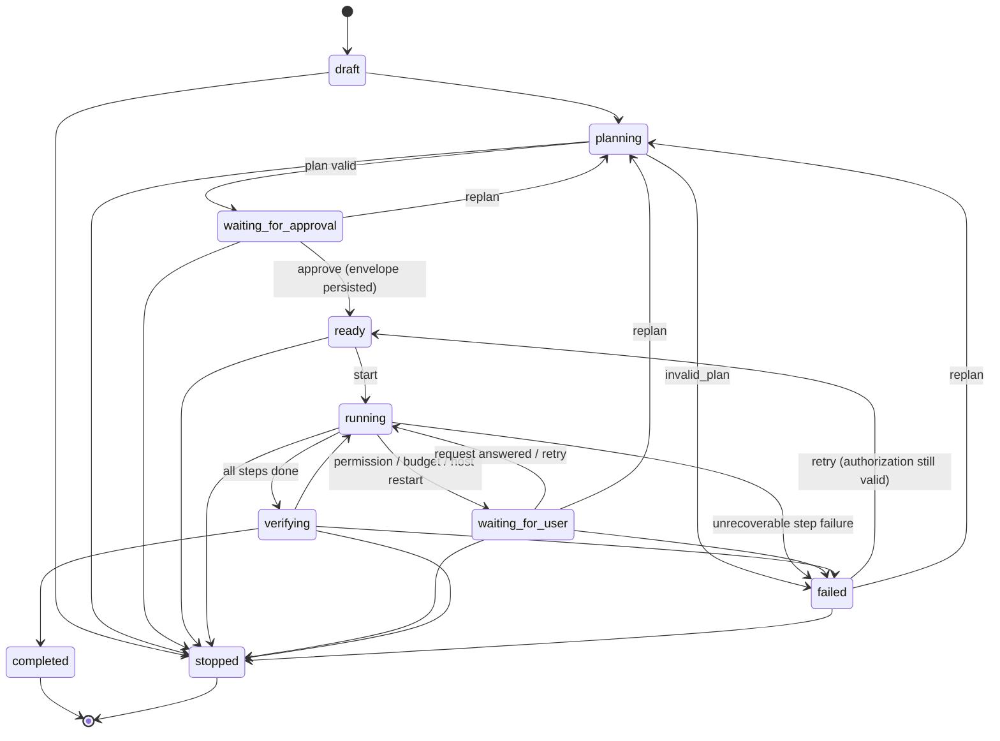
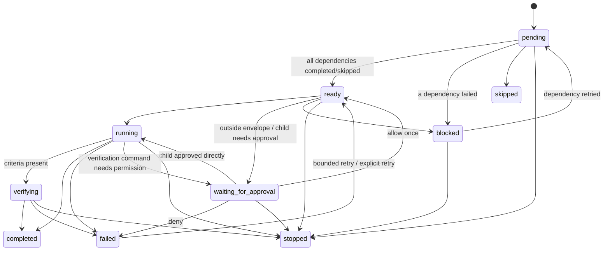

# Bunny-A M-A-0 — Mission and step state machines

Source: `src/lib/bunny-missions/machine.ts`. Every state change goes through `assertMissionTransition` / `assertStepTransition`; an impossible transition throws instead of succeeding.

## Mission

`completed` and `stopped` are terminal. Recovery after a Host restart moves `running/verifying/ready` missions with interrupted steps to `waiting_for_user` (via `running`), fails missions caught in `planning`, and resumes scheduling for running missions that had no executing step.

## Step

## Scheduling (`MissionManager.tickOnce`)

1. Only `running` missions schedule; the runtime limit (min of envelope budget and `maxMissionRuntimeMs`) is checked first.
2. `pending` steps whose dependencies are all `completed`/`skipped` become `ready` (`mission.step.ready`).
3. `ready` steps launch in plan order while running+verifying < `maxConcurrentAgents` (default 3). Independent steps therefore run in parallel.
4. A step acquires a workspace lock first (write → exclusive, read → shared; nested folders conflict). A busy workspace keeps the step `ready` and records `mission.step.waiting_workspace` once; the 15 s watchdog retries.
5. Evaluation: all steps done → `verifying` → `completed`; nothing running/ready and a step waits for permission → `waiting_for_user`; otherwise → `failed` with the first failed step's category.

## Failure categories and retry policy

| Category | Policy |
|---|---|
| `user_stopped` | never retried |
| `permission_required` | wait for user |
| `permission_denied` | not retried; dependents blocked |
| `budget_exceeded` | wait for user |
| `dependency_failed` | step blocked |
| `invalid_plan` | replan |
| `host_restart` | wait for user; explicit retry starts a **fresh** child task |
| `workspace_conflict` | bounded retry, then wait for user |
| `provider_rate_limited`, `provider_unavailable` | bounded retry, rerouted away from the failed provider **only if another eligible provider exists** |
| `verification_failed` | bounded repair attempt (the failure text is put in the next prompt), then wait for user |
| `timeout`, `provider_failed`, `capability_failed` | bounded retry (`provider_failed` reroutes when possible) |
| `capability_unavailable` | not retried |

Bounds: per step `maxRetries` (default 2 → at most 3 attempts), per mission `budget.maxRetries`, explicit user retries capped at `2 × maxRetries + 1` attempts per step, replans capped by `maxReplans` (2). Every attempt is stored (`step.attempts`).

## Progress

`missionProgress(steps)` returns `{kind: "steps", completed, total, failed, running}`; `weighted` only when every step has an explicit positive weight. Time never contributes. An agent's own progress is shown as determinate only when its provider published a finite plan (`finitePlan`), otherwise "Indeterminate — no published plan".

## Events (journal types)

`mission.created, mission.planning, mission.planned, mission.approval_required, authorization.granted, authorization.denied, authorization.required, mission.started, mission.step.ready, mission.step.started, mission.step.child_created, mission.step.workspace, mission.step.waiting_workspace, mission.step.workspace_warning, mission.step.verifying, mission.step.completed, mission.step.failed, mission.step.retrying, mission.step.blocked, mission.permission_required, mission.waiting_for_user, mission.resumed, mission.verifying, mission.completed, mission.failed, mission.stopped, mission.retry, mission.replanning, mission.recovered, mission.configured, mission.error, capability.requested, capability.started, capability.completed, capability.failed, capability.grant_changed, skill.executed, skill.failed, skill.candidate, skill.promoted, notification.sent, trigger.created, trigger.enabled, trigger.disabled, trigger.deleted, trigger.fired, trigger.suppressed, trigger.failed`. Child tasks keep their existing `task.*`, `agent.*`, `approval.*` events, now tagged with `missionId`.
